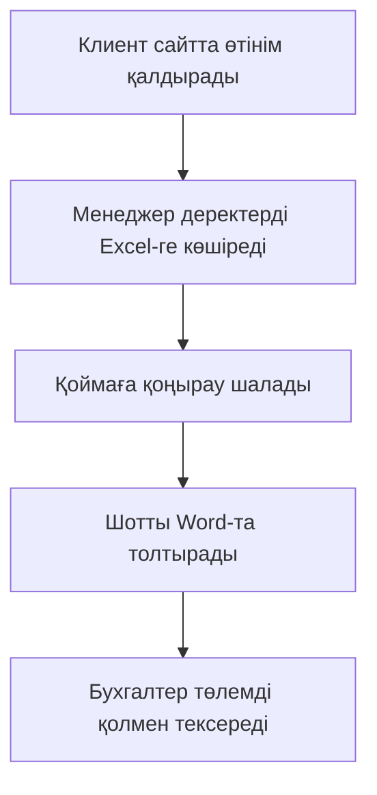

# Практика: AS-IS және TO-BE модельдері

## 1. AS-IS модель («Қалай бар»)


## 2. TO-BE модель («Қалай болады»)
```mermaid
graph TD
  A[Клиент тапсырыс береді] --> B[CRM жүйесіне автоматты түрде түседі]
  B --> C[Жүйе қоймадағы қалдықтарды тексереді]
  C --> D[Шот автоматты түрде қалыптасады]
  D --> E[Төлем мәртебесі банкпен интеграция арқылы жаңарады]


