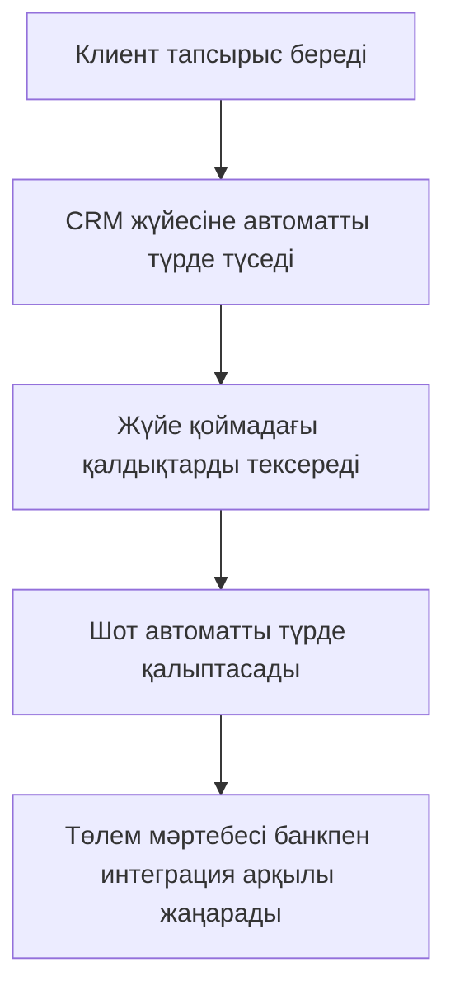

# Практика: AS-IS және TO-BE модельдері

## 1. AS-IS модель («Қалай бар»)

## 2. TO-BE модель («Қалай болады»)

## 3. Экономикалық негіздеме

| Көрсеткіш | Мәні |
|----------|------|
| CAPEX (инвестиция) | 2 000 000 ₸ |
| Ай сайынғы үнем | 400 000 ₸ |
| PBP (өзің-өзі ақтау мерзімі) | 5 ай |
| ROI (жылдық қайтарым) | 140% |

